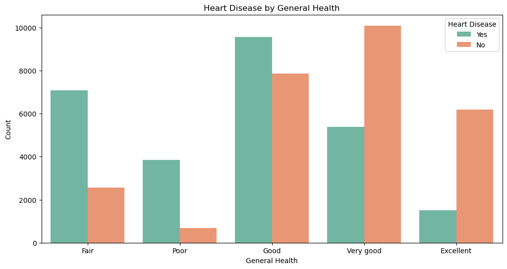

# Heart Disease Prediction

## Overview
This project focuses on building and evaluating machine learning models to predict the risk of heart disease in individuals based on various health-related attributes. The analysis uses a large dataset with multiple features to train and validate models, ultimately aiming to improve healthcare outcomes through predictive analytics.

## Business Understanding
Heart disease is one of the leading causes of death globally, posing a significant challenge for healthcare providers. Early prediction and prevention of heart disease are critical to reducing mortality rates and healthcare costs. The goal of this project is to develop a predictive model that can accurately identify individuals at high risk of heart disease, enabling healthcare providers to implement targeted prevention strategies and optimize resource allocation.

### Key Questions:
1. **How can healthcare providers use predictive analytics to prioritize patients for early intervention and tailored treatment plans?**
2. **How can existing health data be leveraged to accurately predict the risk of heart disease in individuals?**

## Data Understanding
The dataset used in this analysis is from [Kaggle](https://www.kaggle.com/datasets/abubakarsiddiquemahi/heart-disease-dataset) contains information about 319,795 individuals and includes 18 features related to their health, such as BMI, smoking status, alcohol consumption, physical and mental health, and more. The target variable is whether an individual has heart disease (HeartDisease: Yes/No).

1. BMI (Body Mass Index): A measure of body fat based on height and weight.
2. Smoking Status: Whether the individual is a current smoker.
3. Alcohol Drinking: Whether the individual frequently consumes alcohol.
4. Stroke: Whether the individual has had a stroke.
5. Physical Health: Self-reported days of poor physical health in the past 30 days.
6. Mental Health: Self-reported days of poor mental health in the past 30 days.
7. Difficulty Walking: Whether the individual has difficulty walking or climbing stairs.
8. Sex: Gender of the individual.
9. Age Category: The age range of the individual.
10. Race: The race or ethnicity of the individual.
11. Diabetes: Whether the individual has diabetes.
12. Physical Activity: Whether the individual engages in regular physical activity.
13. General Health: Self-reported general health status.
14. Sleep Time: Average number of hours of sleep per night.
15. Asthma: Whether the individual has asthma.
16. Kidney Disease: Whether the individual has kidney disease.
17. Skin Cancer: Whether the individual has had skin cancer.
18. Heart Disease (Target Variable): Whether the individual has heart disease (Yes/No).

### Data Cleaning: 
The dataset was checked for missing values and inconsistencies. Fortunately, the dataset was well-structured with no missing values, allowing for straightforward processing.

### Encoding Categorical Variables: 
Categorical variables such as smoking status, alcohol consumption, and race were encoded using label encoding and one-hot encoding to convert them into numerical formats suitable for machine learning models.

### Balancing the Dataset: 
The dataset was significantly imbalanced, with a majority of individuals not having heart disease. To address this, techniques such as downsampling the majority class and applying SMOTE (Synthetic Minority Over-sampling Technique) were used to create a balanced dataset for training.

### Exploratory Data Analysis (EDA)
Exploratory Data Analysis was conducted to gain insights into the distributions of key features and their relationships with the target variable, heart disease. Some of the key observations from the EDA include:

__Age and Heart Disease:__ As expected, the likelihood of heart disease increased with age, particularly in individuals aged 50 and above.

__General Health:__ Individuals with less than "Excellent" or "Very Good" general health seemed to be more prone to heart disease

__BMI Distribution:__ Individuals with heart disease tended to have higher BMI on average compared to those without heart disease.

## Models and Evaluation

Several machine learning models were developed and evaluated to determine their effectiveness in predicting heart disease. At first I used the a sample of the datset to attempt to balance it for the modeling process, but the scores were not as good as i was hoping for so I decided to use the entire dataset while using SMOTE to help balance the data. On the balanced sampled data, the SVM model performed best but when used on the entire balanced dataset the performance fell off. The models implemented include:

__Logistic Regression:__ A simple yet effective baseline model for binary classification tasks. It provided a good starting point for comparison with more complex models.

__Random Forest Classifier:__ An ensemble learning method that operates by constructing multiple decision trees. It performed well due to its ability to handle the high-dimensional feature space and capture complex interactions between features.

__XGBoost (Extreme Gradient Boosting):__ A powerful gradient boosting model known for its high performance and speed. XGBoost was particularly effective in handling imbalanced datasets.

__Support Vector Machine (SVM):__ A robust model for classification tasks, particularly when the classes are not linearly separable.

### Ensemble Techniques
In addition to individual models, ensemble methods such as stacking and voting were implemented. These methods combine the predictions from multiple models to improve overall accuracy and robustness. The stacked model, in particular, outperformed individual models by leveraging the complementary strengths of different algorithms, resulting in fewer false negatives—a critical consideration in predicting heart disease.

#### Random Forest:
- The random Forest model put out pretty good scores after hypertuning
1. __Accuracy:__ 0.88
2. __Precision:__ 0.8620
3. __Recall:__ 0.9082
4. __F1-Score:__ 0.8845

#### XGBoost:
- The XGBoost Model was slightly worse in the overall scores

1. __Accuracy:__ 0.8138
2. __Precision:__ 0.7950
3. __Recall:__ 0.8456
4. __F1-Score:__ 0.8195

#### Stacked Model:

- By combining both models into a stacked meta model, the strengths of both models could be used effectively. This model also had the least amount of false negatives, which is essential in predictiing something in the healthcare field.

1. __Accuracy:__ 0.8819
2. __Precision:__ 0.8730
3. __Recall:__ 0.8938
4. __F1-Score:__ 0.8833

### Results

- The final ensemble model (stacked model) slightly improved the prediction metrics, achieving a test accuracy of 88.19%, precision of 87.30%, recall of 89.38%, and F1-score of 88.33%.
- The models demonstrated that features like physical activity, BMI, age, and general health perception are significant predictors of heart disease.

### Final Model Deployment
The final stacked model was saved using the pickle module, making it ready for deployment. This current model is just a prototype and needs more work before it can actually be used in a real-world clinical setting.

## Conclusions
The analysis provides actionable insights for healthcare providers:
1. **Targeted Interventions**: By identifying high-risk individuals based on key predictors, healthcare providers can implement personalized interventions, such as exercise programs and regular health check-ups.
2. **Resource Allocation**: Predictive models can help allocate healthcare resources more effectively, focusing on high-risk patients and potentially reducing hospital admissions and treatment costs.
3. **Preventive Healthcare**: Emphasizing preventive care, such as lifestyle modifications and early detection through predictive analytics, can significantly reduce the burden of heart disease on the healthcare system.

## Future Work
- **Model Improvement**: Further improvements can be explored by incorporating additional features or using more advanced ensemble techniques.

- **Broader Application**: The approach can be generalized to other health-related predictions, such as predicting other chronic diseases.

- **Incorporating Additional Features**: Including more data, such as detailed dietary habits or genetic information, could further enhance the predictive power of the models.

# Contact
- __For any questions contact [James Warsing](www.linkedin.com/in/jameswarsing)__